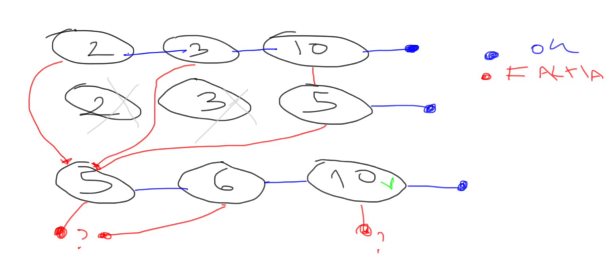

Algorítmo

O objetivo deste algorítmo é entender uma frase.

Exemplo

Qual é seu nome?

A ideia central é que vários "ifs" decidirão o significado.

Nós fazemos uma lista de perguntas ou 'ifs'.

As perguntas para esta frase poderiam ser.
```
 1 - A primeira palavra é 'Qual' ?
 2 - A segunda palavra é 'é' ? 
 3 - A terceira palavra é 'seu' ? 
 4 - A quarta palavra é 'nome' ?  
 5 - A quinta palavra é '?' ? 
```

Se todas estas perguntas tiverem resposta afirmativa
significa que atingimos um estado conhecido definido
por um ser humano. Neste caso o estado seria
"Quem perguntou quer saber seu nome".

Existem várias destas listas de perguntas para entender 
cada frase.
O algorítmo força bruta é passar por todas as listas
verificando cada pergunta. Se todas as respostas 
da lista forem positivas atingimos o estado.

(
 Notem que podemos fazer as perguntas de forma não sequencial.
)


Otimização:

Representamos cada lista de perguntas como uma linha
com perguntas ordenadas.

Exemplo:
```
0: 2 10 24  
```

Esta é a linha 0.
Ela tem a pergunta 2, pergunta 10, pergunta 24.

Temos várias linhas também ordenadas pelas perguntas
formando uma tabela:

```
    0  1  2
----------------
0:  2 10 24
1:  2 11 12
2:  3 10
3:  9 10 12 54
----------------
```

Dado uma entrada nós começamos fazendo a primeira 
pergunta da primeira linha. (pergunta 2)

Se a resposta for true fazemos a pergunta seguinte da 
mesma linha (pergunta 10). Caso contrário passamos para 
próxima linha.

Se a próxima linha tem mesmo começo de perguntas 
  Fazemos a próxima pergunta (pergunta 11) nesta linha
  e assim por diante.
Senão
  Fazemos a primeira pergunta desta nova linha


Nós podemos deixar pré computado para onde é o jump

Cada pergunta já pode ter para onde vai no YES e para onde vai no NO.
Ela tambem pode ja ter computador o resultado e deixa pronto.
O algorimo so vai perseguindo.




Este sistema pode ser usado para indexar documentos.

Por exemplo pega-se o titulo ou palavras chavas e se usa
para programar a entrada.

----

É preciso de uma linguagem de programação da tabela.

Ela tem que aceitar frases.


-- 

O problema pode ser visto de forma diferente.


Entramos com algums numeros

Exemplo 6 e 50.
Queremos procurar se eles pertecem a varios conjuntos.

```
A 02 06 50 61
B 02 10 60
C 10 30 31
D 20 50 51
```

Podemos criar vários conjuntos ordenados por cada coluna.
(O primeiro já foi ordenado pela coluna 1.)

```
A 02 06 50 61
B 02 10 60
C 10 30 31
D 20 50 51
```

```
C 10 30 31
A 02 06 50 61
D 20 50 51
B 02 10 60
```

```
A 02 06 50 61
```
Ao procurar algo nos fazemos busca binaria
em cada grupo destes.

Entramos 6 e procuramos a linha. Vai cair na linha A.
Nós executamos o algoritmo da linha A. 
(os numeros dissem apenas de quais dados ele dependende)
Apos marcamos a linha A como pronta.


O numero de ordenacoes vai ser a maior busca, ou a linha que dependa de um maior numero de palavras.


