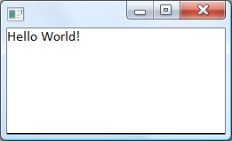
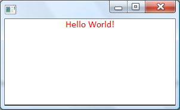

##GuiExpress

What is GuiExpress?

The GuiExpress is a library that I am developing to create user interfaces based on HTML and CSS.
The primary goal is to have a gui library to create small applications with rich features and easy to use and get results.
The GuiExpress is being developed to run in Windows and Windows Mobile.
You can download the files at the user group.

Hello world

Let's see the Hello world sample

```cpp

#include "stdafx.h"
#include "guiexpress/guiexpress.h"

using namespace GuiEx;

int APIENTRY _tWinMain(HINSTANCE hInstance,
                     HINSTANCE hPrevInstance,
                     LPTSTR    lpCmdLine,
                     int       nCmdShow)
{
   Document doc;
   doc.Write(L"Hello World!");
   return Run(doc);
}
```


The fancy main funtion above is the windows entry point. You can generate a default windows project inside the VC++ and modify it to compile this hello world sample.
As I said, the library is based on HTML, so you can easily change the appearance of your text.
For instance:

```cpp
Document doc;
doc.Write(L"<p style='text-align:center; color:red'>Hello World!</p>");
return Run(doc);
```



##Creating a document class

We can derive your class from the GuiEx::Document having something like a form.

```cpp
class MainPage : public GuiEx::Document
{
public:
    MainPage();
};

MainPage::MainPage()
{
  Write(L"Hello world");
}
```
