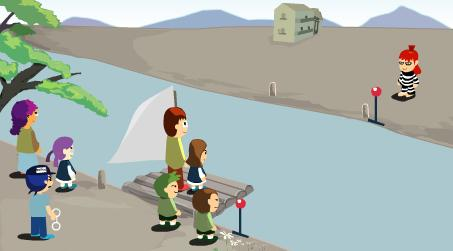

##River Crossing Puzzle

* A father and his two sons, a mother and her two daughters, a thief and a policeman are on one side of a river. 
* There is a boat by the river bank, but it can only take two people at a time. 
* Only the father, the mother and the policeman know how to operate the boat. 
*The father can not be with any of the girls without their mother around. 
* The mother can not be with any of the boys without their father around. 
* The thief can not be with anyone else without the policeman around. How can you get everyone across to the other side of the river?

[http://www.smallcampus.net/upload/html/maths_games/2001-05-03/riverIQGame.swf](play the game here)


 
Solution using C++ :)

```cpp

#include <iostream>
#include <iomanip>

using namespace std;


int travels = 18;
int solution = 0;
int solution_counter = 0;

enum People
{
    None      = 0,
    Father    = 1 << 0,
    Mother    = 1 << 1,
    Son1      = 1 << 2,
    Son2      = 1 << 3,
    Daughter1 = 1 << 4,
    Daughter2 = 1 << 5,
    Policeman = 1 << 6,
    Thief     = 1 << 7
};


inline People operator | (const People & a, People b) {
    return static_cast<People>( static_cast<long>(a) |
        static_cast<long>(b));
}

inline People operator~ (People X) {
    return static_cast<People>(~static_cast<long>(X));
}

inline People operator& (People X, People Y) {
    return static_cast<People>(static_cast<long>(X) &
        static_cast<long>(Y));
}

inline People& operator&=(People& X, People Y) {
    X = (People) (X & Y);
    return X;
}


std::ostream& operator << (std::ostream &os, People e2)
{
    if (e2 == None)
        std::cout << "None";
    else
    {
        static const char * days[] = {"Father", "Mother", "Son1", "Son2",
            "Daughter1", "Daughter2",  "Policeman" , "Thief"};
        bool bFirst = true;
        for (int i = 0; i < 8; i++)
        {
            if ( e2 & (1 << i) )
            {
                if (!bFirst)
                    os << ", ";
                else
                    bFirst = false;
                os << days[i];
            }
        }
    }
    return os;
}

bool Test(People side)
{
    if (side == None)
        return true;

    //The father can not be with any of the girls without their mother around
    if ( ((Daughter1 | Daughter2) & side) && (Father & side) && !(Mother & side) ) {
        return false;
    }

    //Mother can not be with any of the boys without their father around
    if ( ((Son1 | Son2) & side) && (Mother & side) && !(Father & side) ) {
        return false;
    }

    //The thief can not be with anyone else without the policeman around
    if (((Father | Mother | Son1 | Son2 | Daughter1 | Daughter2) & side) &&
        (Thief & side) && !(Policeman & side))
    {
        return false;
    }

    return true;
}

struct Tab {
    static int tab;
    Tab() { tab++; }
    ~Tab(){ tab--; }
    operator int() { return tab; }
};

int Tab::tab = 0;

void Print(int i, People sideA, People sideB, People barco, bool bIda)
{
    if (bIda)
        cout <<  sideA << " >>>>> " << barco <<  " >>>>> " <<  sideB << endl;
    else
        cout <<  sideB << " <<<<< " << barco <<  " <<<<< " << sideA << endl;
}

bool Move(const People barco,
           const People origem,
           const People destino,
           const bool bIda)
{
    Tab tab;

    if (tab.tab > travels)
        return false;

    for (int i = 0; i < 8; i++)
    {
        const People candidate1 = static_cast<People>(1 << i);
        if (!(candidate1 & origem)) continue;

        // candidate test

        //Only the father, the mother and the policeman know how to operate the boat
        if (candidate1 & (Father | Mother | Policeman))
        {
            People nova_origem  = origem & (~ ( candidate1 ) );
            People novo_destino = destino | candidate1;

            if ( (candidate1 != barco) && // do not repeat
                Test(nova_origem) && Test(novo_destino))
            {
                // ok
                if (Move(candidate1, novo_destino, nova_origem, !bIda))
                {
                    Print(tab, nova_origem, destino, candidate1, bIda);
                    return true;
                }
            }
        }

        // get a candidate
        for (int j = i; j < 8; j ++)
        {
            const People candidate2 = static_cast<People>(1 << j);
            if ( (candidate2 == candidate1) || !(candidate2 & origem)) continue;

            //Only the father, the mother and the policeman know how to operate the boat
            if ( ( candidate1 | candidate2 ) & (Father | Mother | Policeman))
            {
                People nova_origem  = origem & (~ ( candidate1 | candidate2) );
                People novo_destino = destino | candidate1 | candidate2;


                if ( (candidate1 | candidate2) != barco && // is the same?
                    Test(nova_origem) && Test(novo_destino))
                {
                    bool bStop = bIda ? nova_origem == None : novo_destino == None;
                    if (bStop && tab.tab == travels )
                    {
                        solution_counter++;
                        if ( solution == solution_counter)
                        {
                            Print(tab, nova_origem, destino, candidate1 | candidate2, bIda);
                            return true;
                        }
                    }
                    else if (Move(candidate1 | candidate2, novo_destino,  nova_origem, !bIda))
                    {
                        Print(tab, nova_origem, destino, candidate1 | candidate2, bIda);
                        return true;
                    }
                }
            }
        }
    }
    return false;
}


int main()
{
    People origem = Father | Mother | Son1 | Son2 | Daughter1 | Daughter2 | Policeman | Thief;
    People destino = None;


    for (int i = 0; i < 1000; i++)
    {
        solution_counter = 0;
        solution = i;
        travels = 17; //  how many travels?
        if (Move(None, origem, destino, true))
        {
            cout << i << endl;
        }
    }
}


// output (read from bottom to top. there are 8 solutions printed with 17 travels)

None >>>>> Policeman, Thief >>>>> Father, Mother, Son1, Son2, Daughter1, Daughter2
Thief <<<<< Policeman <<<<< Father, Mother, Son1, Son2, Daughter1, Daughter2
Thief >>>>> Daughter2, Policeman >>>>> Father, Mother, Son1, Son2, Daughter1
Daughter2 <<<<< Policeman, Thief <<<<< Father, Mother, Son1, Son2, Daughter1
Daughter2 >>>>> Mother, Daughter1 >>>>> Father, Son1, Son2, Policeman, Thief
Daughter1, Daughter2 <<<<< Mother <<<<< Father, Son1, Son2, Policeman, Thief
Daughter1, Daughter2 >>>>> Father, Mother >>>>> Son1, Son2, Policeman, Thief
Mother, Daughter1, Daughter2 <<<<< Father <<<<< Son1, Son2, Policeman, Thief
Mother, Daughter1, Daughter2 >>>>> Policeman, Thief >>>>> Father, Son1, Son2
Daughter1, Daughter2, Policeman, Thief <<<<< Mother <<<<< Father, Son1, Son2
Daughter1, Daughter2, Policeman, Thief >>>>> Father, Mother >>>>> Son1, Son2
Mother, Daughter1, Daughter2, Policeman, Thief <<<<< Father <<<<< Son1, Son2
Mother, Daughter1, Daughter2, Policeman, Thief >>>>> Father, Son2 >>>>> Son1
Father, Mother, Son2, Daughter1, Daughter2 <<<<< Policeman, Thief <<<<< Son1
Father, Mother, Son2, Daughter1, Daughter2 >>>>> Son1, Policeman >>>>> Thief
Father, Mother, Son1, Son2, Daughter1, Daughter2 <<<<< Policeman <<<<< Thief
Father, Mother, Son1, Son2, Daughter1, Daughter2 >>>>> Policeman, Thief >>>>> None
1


None >>>>> Policeman, Thief >>>>> Father, Mother, Son1, Son2, Daughter1, Daughter2
Thief <<<<< Policeman <<<<< Father, Mother, Son1, Son2, Daughter1, Daughter2
Thief >>>>> Daughter1, Policeman >>>>> Father, Mother, Son1, Son2, Daughter2
Daughter1 <<<<< Policeman, Thief <<<<< Father, Mother, Son1, Son2, Daughter2
Daughter1 >>>>> Mother, Daughter2 >>>>> Father, Son1, Son2, Policeman, Thief
Daughter1, Daughter2 <<<<< Mother <<<<< Father, Son1, Son2, Policeman, Thief
Daughter1, Daughter2 >>>>> Father, Mother >>>>> Son1, Son2, Policeman, Thief
Mother, Daughter1, Daughter2 <<<<< Father <<<<< Son1, Son2, Policeman, Thief
Mother, Daughter1, Daughter2 >>>>> Policeman, Thief >>>>> Father, Son1, Son2
Daughter1, Daughter2, Policeman, Thief <<<<< Mother <<<<< Father, Son1, Son2
Daughter1, Daughter2, Policeman, Thief >>>>> Father, Mother >>>>> Son1, Son2
Mother, Daughter1, Daughter2, Policeman, Thief <<<<< Father <<<<< Son1, Son2
Mother, Daughter1, Daughter2, Policeman, Thief >>>>> Father, Son2 >>>>> Son1
Father, Mother, Son2, Daughter1, Daughter2 <<<<< Policeman, Thief <<<<< Son1
Father, Mother, Son2, Daughter1, Daughter2 >>>>> Son1, Policeman >>>>> Thief
Father, Mother, Son1, Son2, Daughter1, Daughter2 <<<<< Policeman <<<<< Thief
Father, Mother, Son1, Son2, Daughter1, Daughter2 >>>>> Policeman, Thief >>>>> None
2


None >>>>> Policeman, Thief >>>>> Father, Mother, Son1, Son2, Daughter1, Daughter2
Thief <<<<< Policeman <<<<< Father, Mother, Son1, Son2, Daughter1, Daughter2
Thief >>>>> Daughter2, Policeman >>>>> Father, Mother, Son1, Son2, Daughter1
Daughter2 <<<<< Policeman, Thief <<<<< Father, Mother, Son1, Son2, Daughter1
Daughter2 >>>>> Mother, Daughter1 >>>>> Father, Son1, Son2, Policeman, Thief
Daughter1, Daughter2 <<<<< Mother <<<<< Father, Son1, Son2, Policeman, Thief
Daughter1, Daughter2 >>>>> Father, Mother >>>>> Son1, Son2, Policeman, Thief
Mother, Daughter1, Daughter2 <<<<< Father <<<<< Son1, Son2, Policeman, Thief
Mother, Daughter1, Daughter2 >>>>> Policeman, Thief >>>>> Father, Son1, Son2
Daughter1, Daughter2, Policeman, Thief <<<<< Mother <<<<< Father, Son1, Son2
Daughter1, Daughter2, Policeman, Thief >>>>> Father, Mother >>>>> Son1, Son2
Mother, Daughter1, Daughter2, Policeman, Thief <<<<< Father <<<<< Son1, Son2
Mother, Daughter1, Daughter2, Policeman, Thief >>>>> Father, Son1 >>>>> Son2
Father, Mother, Son1, Daughter1, Daughter2 <<<<< Policeman, Thief <<<<< Son2
Father, Mother, Son1, Daughter1, Daughter2 >>>>> Son2, Policeman >>>>> Thief
Father, Mother, Son1, Son2, Daughter1, Daughter2 <<<<< Policeman <<<<< Thief
Father, Mother, Son1, Son2, Daughter1, Daughter2 >>>>> Policeman, Thief >>>>> None
3


None >>>>> Policeman, Thief >>>>> Father, Mother, Son1, Son2, Daughter1, Daughter2
Thief <<<<< Policeman <<<<< Father, Mother, Son1, Son2, Daughter1, Daughter2
Thief >>>>> Daughter1, Policeman >>>>> Father, Mother, Son1, Son2, Daughter2
Daughter1 <<<<< Policeman, Thief <<<<< Father, Mother, Son1, Son2, Daughter2
Daughter1 >>>>> Mother, Daughter2 >>>>> Father, Son1, Son2, Policeman, Thief
Daughter1, Daughter2 <<<<< Mother <<<<< Father, Son1, Son2, Policeman, Thief
Daughter1, Daughter2 >>>>> Father, Mother >>>>> Son1, Son2, Policeman, Thief
Mother, Daughter1, Daughter2 <<<<< Father <<<<< Son1, Son2, Policeman, Thief
Mother, Daughter1, Daughter2 >>>>> Policeman, Thief >>>>> Father, Son1, Son2
Daughter1, Daughter2, Policeman, Thief <<<<< Mother <<<<< Father, Son1, Son2
Daughter1, Daughter2, Policeman, Thief >>>>> Father, Mother >>>>> Son1, Son2
Mother, Daughter1, Daughter2, Policeman, Thief <<<<< Father <<<<< Son1, Son2
Mother, Daughter1, Daughter2, Policeman, Thief >>>>> Father, Son1 >>>>> Son2
Father, Mother, Son1, Daughter1, Daughter2 <<<<< Policeman, Thief <<<<< Son2
Father, Mother, Son1, Daughter1, Daughter2 >>>>> Son2, Policeman >>>>> Thief
Father, Mother, Son1, Son2, Daughter1, Daughter2 <<<<< Policeman <<<<< Thief
Father, Mother, Son1, Son2, Daughter1, Daughter2 >>>>> Policeman, Thief >>>>> None
4


None >>>>> Policeman, Thief >>>>> Father, Mother, Son1, Son2, Daughter1, Daughter2
Thief <<<<< Policeman <<<<< Father, Mother, Son1, Son2, Daughter1, Daughter2
Thief >>>>> Son2, Policeman >>>>> Father, Mother, Son1, Daughter1, Daughter2
Son2 <<<<< Policeman, Thief <<<<< Father, Mother, Son1, Daughter1, Daughter2
Son2 >>>>> Father, Son1 >>>>> Mother, Daughter1, Daughter2, Policeman, Thief
Son1, Son2 <<<<< Father <<<<< Mother, Daughter1, Daughter2, Policeman, Thief
Son1, Son2 >>>>> Father, Mother >>>>> Daughter1, Daughter2, Policeman, Thief
Father, Son1, Son2 <<<<< Mother <<<<< Daughter1, Daughter2, Policeman, Thief
Father, Son1, Son2 >>>>> Policeman, Thief >>>>> Mother, Daughter1, Daughter2
Son1, Son2, Policeman, Thief <<<<< Father <<<<< Mother, Daughter1, Daughter2
Son1, Son2, Policeman, Thief >>>>> Father, Mother >>>>> Daughter1, Daughter2
Father, Son1, Son2, Policeman, Thief <<<<< Mother <<<<< Daughter1, Daughter2
Father, Son1, Son2, Policeman, Thief >>>>> Mother, Daughter2 >>>>> Daughter1
Father, Mother, Son1, Son2, Daughter2 <<<<< Policeman, Thief <<<<< Daughter1
Father, Mother, Son1, Son2, Daughter2 >>>>> Daughter1, Policeman >>>>> Thief
Father, Mother, Son1, Son2, Daughter1, Daughter2 <<<<< Policeman <<<<< Thief
Father, Mother, Son1, Son2, Daughter1, Daughter2 >>>>> Policeman, Thief >>>>> None
5


None >>>>> Policeman, Thief >>>>> Father, Mother, Son1, Son2, Daughter1, Daughter2
Thief <<<<< Policeman <<<<< Father, Mother, Son1, Son2, Daughter1, Daughter2
Thief >>>>> Son1, Policeman >>>>> Father, Mother, Son2, Daughter1, Daughter2
Son1 <<<<< Policeman, Thief <<<<< Father, Mother, Son2, Daughter1, Daughter2
Son1 >>>>> Father, Son2 >>>>> Mother, Daughter1, Daughter2, Policeman, Thief
Son1, Son2 <<<<< Father <<<<< Mother, Daughter1, Daughter2, Policeman, Thief
Son1, Son2 >>>>> Father, Mother >>>>> Daughter1, Daughter2, Policeman, Thief
Father, Son1, Son2 <<<<< Mother <<<<< Daughter1, Daughter2, Policeman, Thief
Father, Son1, Son2 >>>>> Policeman, Thief >>>>> Mother, Daughter1, Daughter2
Son1, Son2, Policeman, Thief <<<<< Father <<<<< Mother, Daughter1, Daughter2
Son1, Son2, Policeman, Thief >>>>> Father, Mother >>>>> Daughter1, Daughter2
Father, Son1, Son2, Policeman, Thief <<<<< Mother <<<<< Daughter1, Daughter2
Father, Son1, Son2, Policeman, Thief >>>>> Mother, Daughter2 >>>>> Daughter1
Father, Mother, Son1, Son2, Daughter2 <<<<< Policeman, Thief <<<<< Daughter1
Father, Mother, Son1, Son2, Daughter2 >>>>> Daughter1, Policeman >>>>> Thief
Father, Mother, Son1, Son2, Daughter1, Daughter2 <<<<< Policeman <<<<< Thief
Father, Mother, Son1, Son2, Daughter1, Daughter2 >>>>> Policeman, Thief >>>>> None
6


None >>>>> Policeman, Thief >>>>> Father, Mother, Son1, Son2, Daughter1, Daughter2
Thief <<<<< Policeman <<<<< Father, Mother, Son1, Son2, Daughter1, Daughter2
Thief >>>>> Son2, Policeman >>>>> Father, Mother, Son1, Daughter1, Daughter2
Son2 <<<<< Policeman, Thief <<<<< Father, Mother, Son1, Daughter1, Daughter2
Son2 >>>>> Father, Son1 >>>>> Mother, Daughter1, Daughter2, Policeman, Thief
Son1, Son2 <<<<< Father <<<<< Mother, Daughter1, Daughter2, Policeman, Thief
Son1, Son2 >>>>> Father, Mother >>>>> Daughter1, Daughter2, Policeman, Thief
Father, Son1, Son2 <<<<< Mother <<<<< Daughter1, Daughter2, Policeman, Thief
Father, Son1, Son2 >>>>> Policeman, Thief >>>>> Mother, Daughter1, Daughter2
Son1, Son2, Policeman, Thief <<<<< Father <<<<< Mother, Daughter1, Daughter2
Son1, Son2, Policeman, Thief >>>>> Father, Mother >>>>> Daughter1, Daughter2
Father, Son1, Son2, Policeman, Thief <<<<< Mother <<<<< Daughter1, Daughter2
Father, Son1, Son2, Policeman, Thief >>>>> Mother, Daughter1 >>>>> Daughter2
Father, Mother, Son1, Son2, Daughter1 <<<<< Policeman, Thief <<<<< Daughter2
Father, Mother, Son1, Son2, Daughter1 >>>>> Daughter2, Policeman >>>>> Thief
Father, Mother, Son1, Son2, Daughter1, Daughter2 <<<<< Policeman <<<<< Thief
Father, Mother, Son1, Son2, Daughter1, Daughter2 >>>>> Policeman, Thief >>>>> None
7


None >>>>> Policeman, Thief >>>>> Father, Mother, Son1, Son2, Daughter1, Daughter2
Thief <<<<< Policeman <<<<< Father, Mother, Son1, Son2, Daughter1, Daughter2
Thief >>>>> Son1, Policeman >>>>> Father, Mother, Son2, Daughter1, Daughter2
Son1 <<<<< Policeman, Thief <<<<< Father, Mother, Son2, Daughter1, Daughter2
Son1 >>>>> Father, Son2 >>>>> Mother, Daughter1, Daughter2, Policeman, Thief
Son1, Son2 <<<<< Father <<<<< Mother, Daughter1, Daughter2, Policeman, Thief
Son1, Son2 >>>>> Father, Mother >>>>> Daughter1, Daughter2, Policeman, Thief
Father, Son1, Son2 <<<<< Mother <<<<< Daughter1, Daughter2, Policeman, Thief
Father, Son1, Son2 >>>>> Policeman, Thief >>>>> Mother, Daughter1, Daughter2
Son1, Son2, Policeman, Thief <<<<< Father <<<<< Mother, Daughter1, Daughter2
Son1, Son2, Policeman, Thief >>>>> Father, Mother >>>>> Daughter1, Daughter2
Father, Son1, Son2, Policeman, Thief <<<<< Mother <<<<< Daughter1, Daughter2
Father, Son1, Son2, Policeman, Thief >>>>> Mother, Daughter1 >>>>> Daughter2
Father, Mother, Son1, Son2, Daughter1 <<<<< Policeman, Thief <<<<< Daughter2
Father, Mother, Son1, Son2, Daughter1 >>>>> Daughter2, Policeman >>>>> Thief
Father, Mother, Son1, Son2, Daughter1, Daughter2 <<<<< Policeman <<<<< Thief
Father, Mother, Son1, Son2, Daughter1, Daughter2 >>>>> Policeman, Thief >>>>> None
8

```

See also: enums bit sets
